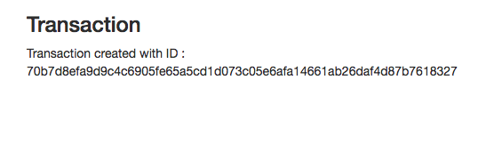

security-chain app
==================

WIP loan securitization on blockchain (bigchain DB)

Setup
======

```
# docker-compose up -d
# go run app/main.go
```

Status
=======

It can create transactions

BUT

Almost nothing works other than creating transactions because of the buggy 0.9 version of bitchain DB
& the go client library supports only <= 0.9, so if we need to use latest versions the library needs fix. 

Submission page


Created



:D
